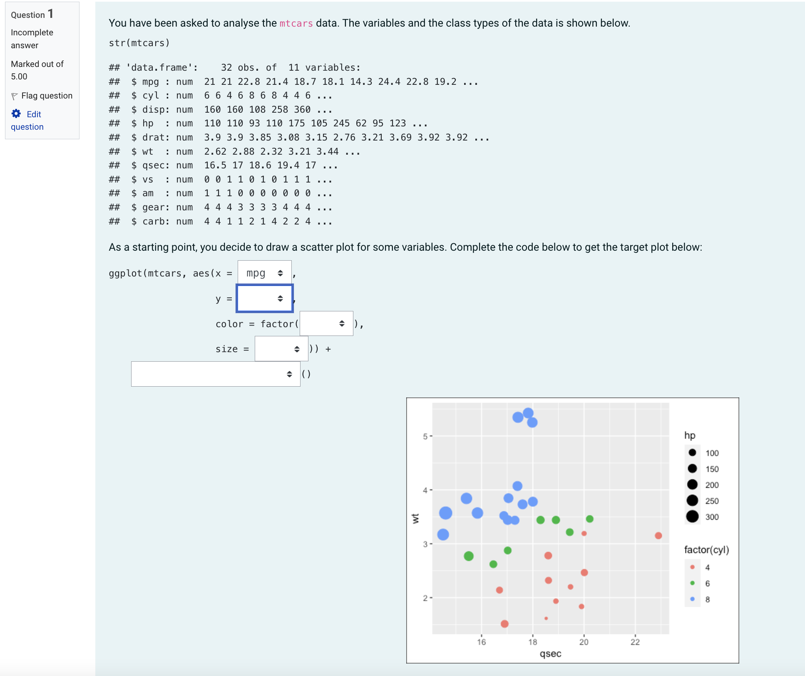

<!-- README.md is generated from README.Rmd. Please edit that file -->


```{r, include = FALSE}
knitr::opts_chunk$set(
  collapse = TRUE,
  comment = "#>",
  fig.path = "man/figures/README-",
  out.width = "100%"
)
```

# moodlequiz

<!-- badges: start -->
[](https://lifecycle.r-lib.org/articles/stages.html#experimental)
[](https://github.com/numbats/moodlequiz/actions/workflows/R-CMD-check.yaml)
<!-- badges: end -->

The `moodlequiz` R package which allows the creation of [Moodle](https://moodle.org/) quiz questions using literate programming with R Markdown. This makes it easy to quickly create a quiz that can be randomly replicated with new datasets, questions, and options for answers.

## Installation

You can install the development version of moodlequiz like so:

``` r
remotes::install_github("numbats/moodlequiz")
```

## Example

Below is a Moodle quiz where the students have to select the right variables from the data to map onto the plot aesthetics in `ggplot2`. 

{style="border:1px solid black;"}

The above quiz is created from the R Markdown document below. Knitting the document below will generate 5 different versions of the quiz where the x, y, color, and size are mapped randomly to one of the variables in the `mtcars` data. 

```{r, echo = FALSE, results="asis"}
cat("````\n")
cat(readLines("man/examples/draw-scatterplots.Rmd"), sep = "\n")
cat("````")
```

