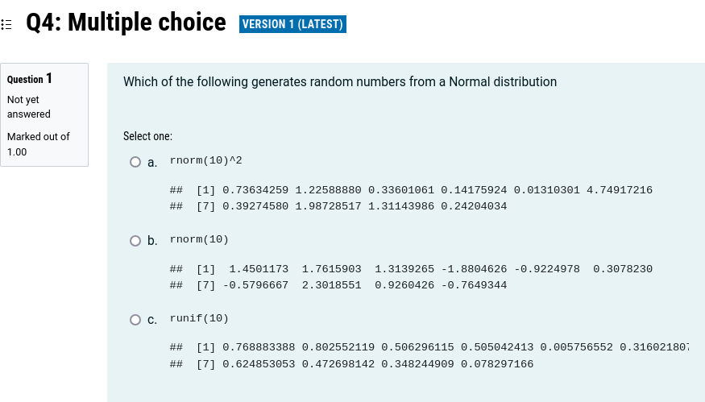
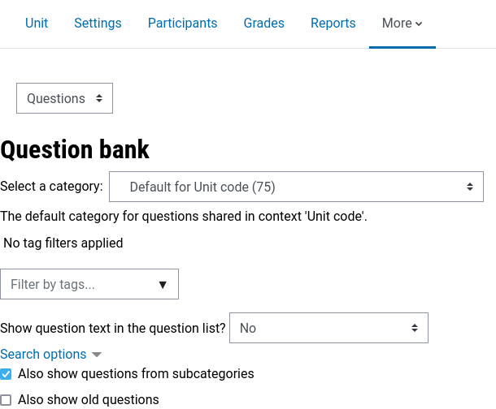
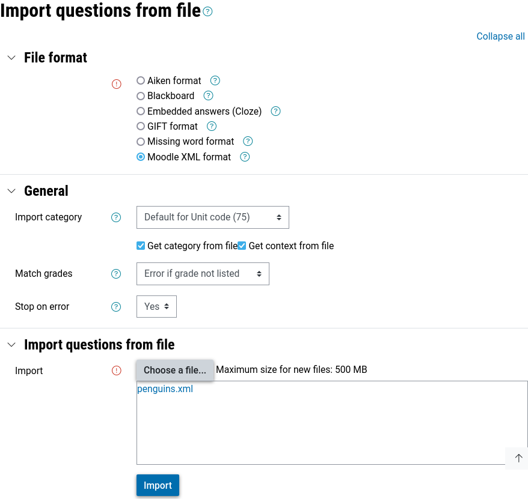
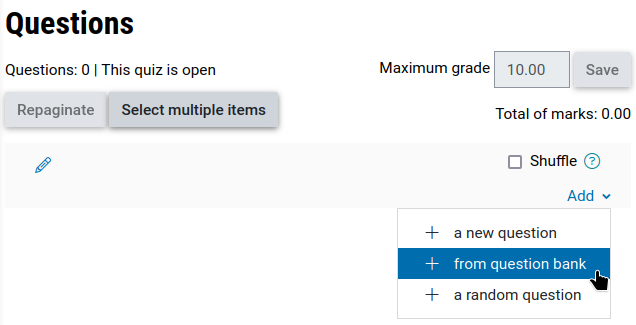
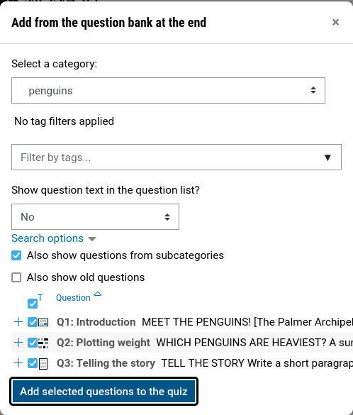
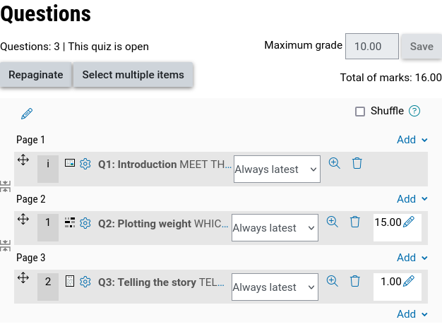

<!-- README.md is generated from README.Rmd. Please edit that file -->

# moodlequiz

<!-- badges: start -->

[](https://lifecycle.r-lib.org/articles/stages.html#experimental)
[](https://github.com/numbats/moodlequiz/actions/workflows/R-CMD-check.yaml)
<!-- badges: end -->

The `moodlequiz` R package which allows the creation of
[Moodle](https://moodle.org/) quiz questions using literate programming
with R Markdown. This makes it easy to quickly create a quiz that can be
randomly replicated with new datasets, questions, and options for
answers.

## Installation

You can install the development version of moodlequiz like so:

``` r
remotes::install_github("numbats/moodlequiz")
```

## Usage

A moodlequiz document produces a [Moodle XML
file](https://docs.moodle.org/405/en/Moodle_XML_format) suitable for
importing quiz questions to Moodle into the question bank. Questions can
be organized into categories to use Moodle’s random question
functionality. An entire quiz consisting of multiple questions can be
written in a single R Markdown document.

### Front matter

The front matter allows you to describe the number of random
replications, and the general category for all of these questions. For
example:

``` yml
---
title: Learning with penguins
output: 
  moodlequiz::moodlequiz:
    replicates: 1
moodlequiz:
  category: penguins
---
```

In this case the questions will be imported into the ‘penguins’
category, with only 1 replicate for each question (the default).

It is possible to use randomization in R to produce many different
replicates of the same question (as shown in the quiz randomization
vignette).

### Body

The R Markdown document’s body is used to create quiz questions with
full markdown support. Any typical markdown output including figures,
equations, tables and cross-references (excepting interactive outputs
[\#31](https://github.com/numbats/moodlequiz/issues/31)) will be
imported as part of your Moodle quiz questions. As a literate
programming user, writing quiz questions with full markdown support is a
wonderful experience compared to the usual quiz creation workflow in
Moodle.

#### Writing questions

Headers are used to separate quiz questions and organize them into
subcategories.

- `# H1: Sub-category`

  Questions within this header will be organised together into this
  sub-category.

  This is useful if your quiz contains several thematically similar
  questions, or if you want to randomize a specific question of group of
  questions.

- `## H2: Quiz questions`

  Quiz questions and their settings are specified within H2 headers.

For example:

``` md

# Basics

## Introduction

...


## Plotting weight

...

## Telling the story {type=essay}

...
```

This example quiz consists of a single sub-category (basics) which
contains three quiz ‘questions’ of different types:

##### Description questions

A ‘description’ question in Moodle doesn’t contain any assessment
activities. It is useful to describe the activity, such as give some
background information on the dataset or learning objectives.

```` md
## Introduction

```{r setup, include = FALSE}
library(moodlequiz)
knitr::opts_chunk$set(echo = FALSE)
```

**Meet the penguins!**


> The `palmerpenguins` data contains size measurements for three penguin species observed on three islands in the Palmer Archipelago, Antarctica.

```{r data, echo = TRUE}
library(palmerpenguins)
penguins
```
````


In this example, a description question is used to provide background
context about the Palmer Archipelago penguins (along with a lovely
illustration and preview of the dataset). Both the image and table will
be bundled into the XML and imported as part of the Moodle quiz
question.

#### Cloze questions

The cloze style questions embed many questions within the question text
(<https://docs.moodle.org/405/en/Embedded_Answers_(Cloze)_question_type>).

There are four types of cloze questions:

- **`cloze_shortanswer()`**: Creates a short-answer question where the
  student provides a text response.
- **`cloze_singlechoice()`**: Generates a single-choice question where
  students select one correct answer from a list.
- **`cloze_multichoice()`**: Creates a multiple-choice question where
  students can select one or more correct answers.
- **`cloze_numerical()`**: Generates a numerical question where students
  input a numeric response with optional tolerance.

The single and multiple choice cloze questions support various options
that change the appearance and shuffling behaviour.

There is also the **`cloze()`** function, which automatically chooses
the appropriate question type based on the class of the input:

- Numerical: `cloze(42)`
- Short answer: `cloze("Australia")`
- Single choice:
  `cloze("rep_len", c("rep", "rep.int", "rep_len", "replicate"))`
- Multiple choice: `cloze(c("A", "B", "C"), LETTERS)`

These functions should be used with inline R code, for example:
`` `r cloze_singlechoice(choices(c("Adelie", "Chinstrap", "Gentoo"), "Chinstrap"))` ``⁠

```` md
## Plotting weight

**Which penguins are heaviest?**

A summary of the penguins dataset is shown below.

```{r}
summary(penguins)
```

The average weight of a penguin is `r cloze(mean(penguins$body_mass_g, na.rm = TRUE), tolerance = 1)`, which is slightly `r cloze("more", c("more", "less"))` than the median weight of `r cloze(median(penguins$body_mass_g, na.rm = TRUE), tolerance = 1)`.

Complete the code to produce the graphic shown in figure \@ref(fig:boxplot).

```r
library(ggplot2)
penguins |> 
  ggplot(aes(x = `r cloze("body_mass_g", colnames(penguins))`, y = `r cloze("species", colnames(penguins))`, fill = `r cloze("species", colnames(penguins))`)) +
  `r cloze("geom_boxplot")`() +
  scale_fill_manual(values = c("darkorange","darkorchid","cyan4")) + 
  theme_minimal()
```

```{r boxplot, fig.cap="Boxplots of penguin weight by species"}
library(ggplot2)
penguins |> 
  ggplot(aes(x = body_mass_g, y = species, fill = species)) +
  geom_boxplot() +
  scale_fill_manual(values = c("darkorange","darkorchid","cyan4")) + 
  theme_minimal()
```

Modify the code to investigate differences in `species` weight by `sex` that produces figure \@ref(fig:boxplot-sex).

```r
library(ggplot2)
penguins |> 
  ggplot(aes(x = `r cloze("body_mass_g", colnames(penguins))`, y = `r cloze("sex", colnames(penguins))`, fill = `r cloze("species", colnames(penguins))`)) +
  `r cloze("geom_boxplot")`() +
  scale_fill_manual(values = c("darkorange","darkorchid","cyan4")) + 
  theme_minimal()
```

```{r boxplot-sex, fig.cap="Boxplots of penguin weight by species and sex"}
penguins |> 
  ggplot(aes(x = body_mass_g, y = sex, fill = species)) +
  geom_boxplot() +
  scale_fill_manual(values = c("darkorange","darkorchid","cyan4")) + 
  theme_minimal()
```

Male penguins `r cloze("tend to", c("almost always", "tend to"))` weigh `r cloze("more", c("more", "less"))` than female penguins. Within each species, male penguins `r cloze("almost always", c("almost always", "tend to"))` weigh `r cloze("more", c("more", "less"))` than female penguins.
````


#### Other questions

Other types of questions consist of a single answer field and some
question text. You can specify any type of questions (even those defined
in Moodle extension packages) with `## Question {type = <TYPE>}`.
Question types included in standard installations of Moodle include:

- multichoice
- truefalse
- shortanswer
- matching (not yet supported)
- essay
- numerical

``` md
## Telling the story {type=essay}

**Tell the story**

Write a short paragraph about how a penguin's weight relates to their species and sex.
```


In the penguins example, you can see that the question type has been set
to `essay`.

------------------------------------------------------------------------

These question types often have many question-specific options which are
outlined in the [Moodle XML
format](https://docs.moodle.org/405/en/Moodle_XML_format) guide.
Question specific options are specified in the question headers, for
example enabling `shuffleanswers` for multiple choice questions with
`## Multiple choice {type=multichoice shuffleanswers=1}`.

Many of these question types require answers specified in
`<answer fraction="...">...</answer>` sections. To specify the answers
for a question with moodlequiz, use the answers div like so:

```` md
## Multiple choice {type=multichoice shuffleanswers=1}

Which of the following generates random numbers from a Normal distribution

::: {.answer fraction="100"}
```{r}
rnorm(10)
```
:::

::: {.answer fraction="0"}
```{r}
runif(10)
```
:::

::: {.answer fraction="0"}
```{r}
rnorm(10)^2
```
:::
````



## Importing questions into Moodle

### Create the XML quiz

Start by rendering the quiz to obtain the Moodle XML file for the quiz.
You can try this with the Palmer penguins quiz described above, which is
found here:
<https://raw.githubusercontent.com/numbats/moodlequiz/refs/heads/main/man/examples/penguins.Rmd>

Once rendered, you should find a corresponding XML file in the same
folder. It should look like this:
<https://raw.githubusercontent.com/numbats/moodlequiz/refs/heads/main/man/examples/penguins.xml>

### Import quiz questions

To import the quiz into Moodle, go to your Moodle course’s question
bank. The navigation may vary among institutions, so if you struggle to
find it the URL pattern is:
`https://<DOMAIN>/question/edit.php?courseid=<COURSE ID>` (where
`<COURSE_ID>` is the number found in most URLs of your course).



Import questions by selecting “Import” from the drop-down.


From the import form:

1.  Select “Moodle XML format” as the file format
2.  Select “Get category from file” under the “General” section
3.  Import the XML file into the file box
4.  Click import



You should now see the questions successfully imported into Moodle,
along with a preview of the questions. Please report any importation
issues.


### Creating a quiz

Create a quiz as you normally would in Moodle (instructions here:
<https://docs.moodle.org/en/Building_Quiz>)

When adding a question, select “from question bank” (or “a random
question” for random questions within categories).



In the question import dialogue:

1.  Select the question category which was specified in the front matter
    (penguins)
2.  Sort questions alphabetically by name by clicking on the “Question”
    header in the table
3.  Select the questions to import via the checkboxes in the table (or
    select all with the checkbox in the table header)
4.  Click “Add selected questions to the quiz”



Your questions are now added to the quiz! :tada:



You can now repaginate and further adjust the quiz settings as
necessary.

<!-- ## Example -->
<!-- Below is an example quiz question which uses the `cloze` question type to select the code which produces the plot. -->
<!-- {style="border:1px solid black;"} -->
<!-- The above quiz is created from the R Markdown document below. Knitting the document below will generate 5 different versions of the quiz where the x, y, color, and size are mapped randomly to one of the variables in the `mtcars` data.  -->
<!-- ```{r, echo = FALSE, results="asis"} -->
<!-- cat("````\n") -->
<!-- cat(readLines("man/examples/draw-scatterplots.Rmd"), sep = "\n") -->
<!-- cat("````") -->
<!-- ``` -->
